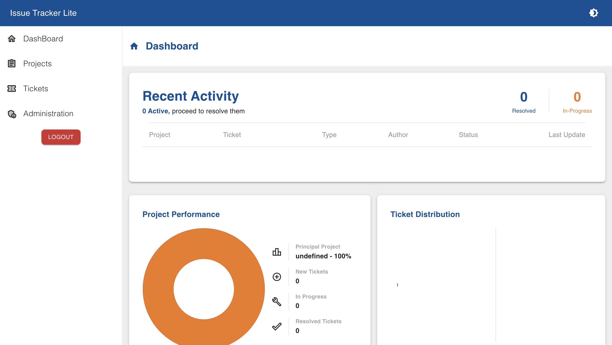
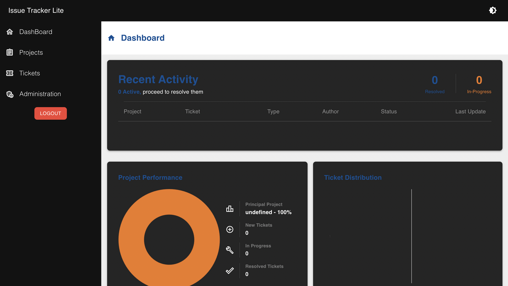
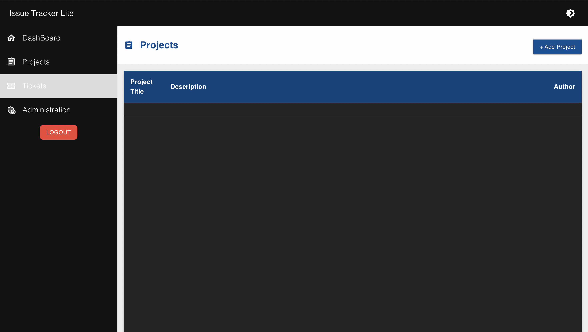
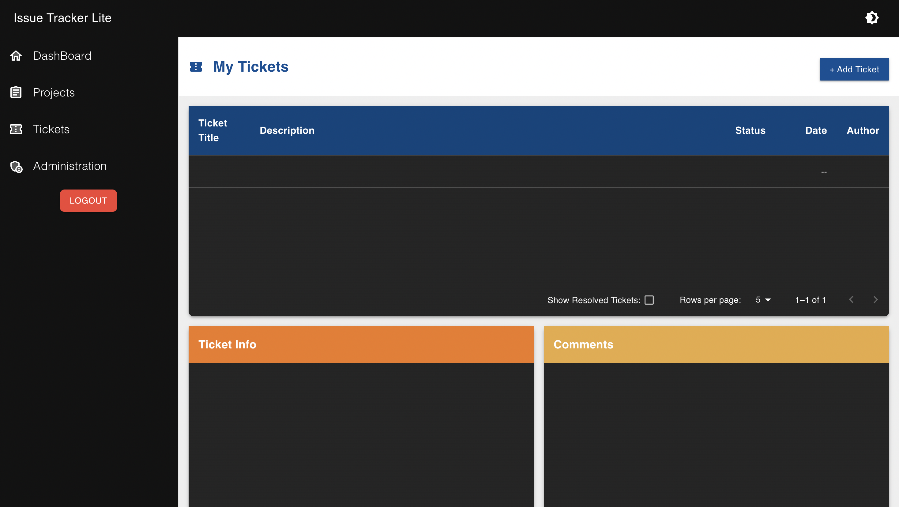
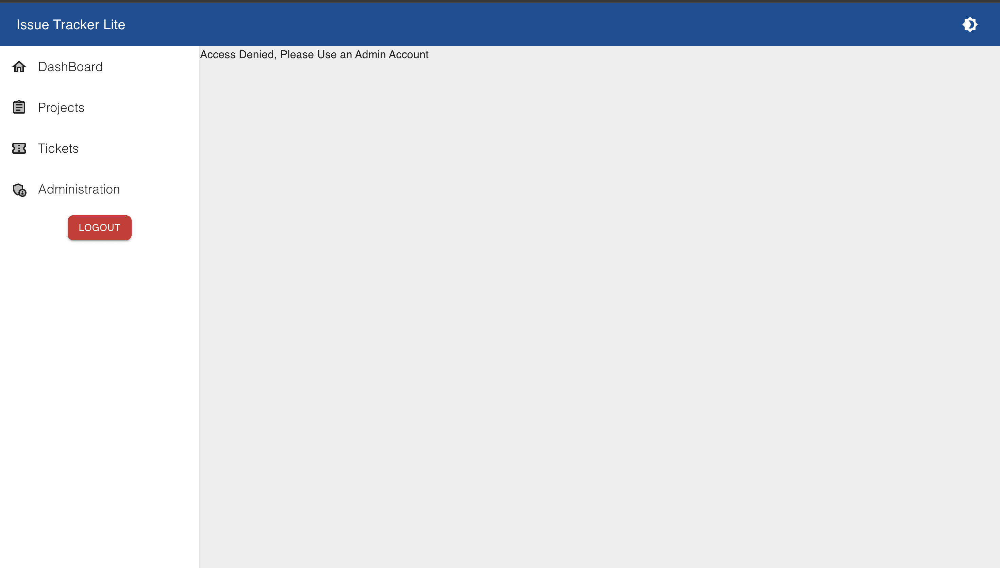

# 🐞 Issue Tracker Lite

A full-stack bug/issue tracking system built with **MongoDB, Express, React, and Node.js (MERN)**.  
Developers can create tickets for projects, admins can manage progress, and everyone can collaborate — now with **light/dark mode** and an **admin ban feature**.

---

## 🌐 Live Links
- **Frontend (Vercel):** [Live Demo](https://issue-tracker-lite-weld.vercel.app/)
- **Backend (Render):** [API](https://issue-tracker-lite-1.onrender.com)

---

## ✨ Features
- 🔐 **Authentication** & password encryption with Bcrypt
- 🔑 **Role-based authorization** using JWT
- 👤 **Admin controls** (ban users by IP, manage projects/tickets)
- 🧾 Projects & tickets (status, priority, type, ETA, dev assignment)
- 💬 Ticket comments
- 📊 Dashboard with charts and recent activity
- 🌗 **Light/Dark theme** toggle with MUI
- 🧰 Global state management with Redux Toolkit
- 📱 Fully responsive design (Flexbox + Grid)

---
## 📸 Screenshots

### Dashboard (Light Mode)

### Dashboard (Dark Mode)

### Projects Page

### Tickets Page

### Admin Page

---

## 🛠️ Technologies Used
| Technology         | Usage                                |
|--------------------|--------------------------------------|
| React Router DOM   | Navigation & Routing                 |
| Material UI (MUI)  | UI Components, Styles & Icons        |
| Redux Toolkit      | Global State Management              |
| Node.js & Express  | REST API Backend                     |
| MongoDB + Mongoose | Database & ODM                       |
| Bcrypt             | Password Encryption                  |
| JSON Web Tokens    | Authentication & Authorization       |
| Axios              | HTTP Requests                        |
| TypeScript (Client)| Type Safety & Error Detection        |
| Render             | Backend Hosting                      |
| Vercel             | Frontend Hosting                     |

---

### How to run server locally
  1. After cloning the repository... Navigate to the Client directory and Install the dependencies in the package.json using `npm i`
  2. Add the environment variables found in [here](/) to your .env file at the root of the Client directory
  3. Start the server using the script `npm run server`

### Deploying the Client & Server
  - Deploy the client by navigating to the client directory and use the script `npm run deploy`
  - Server is automatically re-deployed when pushing a change on the Server directory

